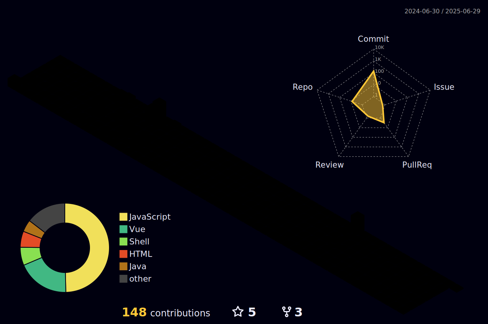

<!---->

## Namaste , It's [Harsh!](https://g.dev/harsh1x4)
Ever since I joined GitHub 1 years ago, I pushed 1353 commits, opened 14 issues, submitted 55 pull requests, created 68 personal projects, and contributed to 43 public repositories. 
 

<!-- 

 -->

 

### 🛠 Frameworks and Tools I'm interested in

### 📈 Github Contribution Graph

### ⚙️ Github Analytics

  
  
<!--   
   -->

<!-- 

 -->
